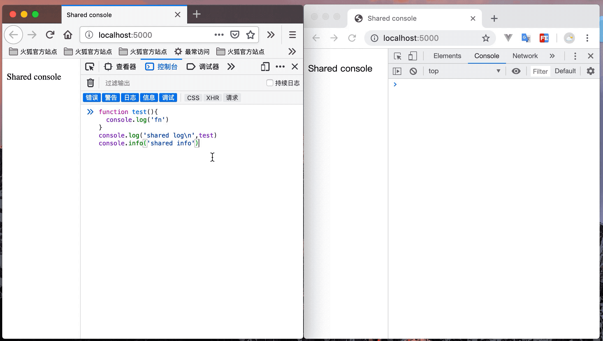
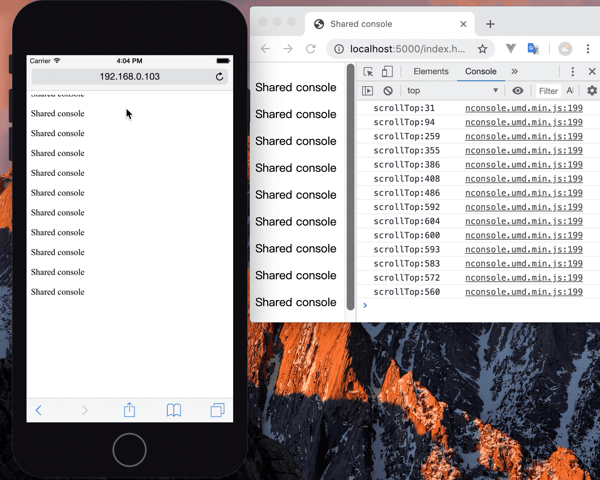
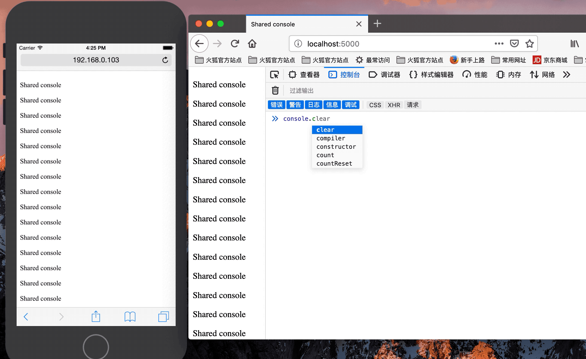

# nConsole
Shared console
跨端共享 console.log & 跨端监控解决方案

## nConsole 特性

### 1\. 跨端共享 console.log

- 打开其他此页面窗口或其他设备时，数据共享打印
- 共享代码的 error ,监听了全局的错误事件 onerror

```js
function test(){
  console.log('fn')
}
console.log('shared log',test)
console.info('shared info')
```




```js
// 监听滚动条高度
document.querySelector('#content').onscroll = function(e){
  console.log('scrollTop:'+ e.target.scrollTop)
}
```



### 2\. 跨端执行 console.compiler

```js
// 让其他正在开启的浏览器执行表达式
// 打印结果为其他端的浏览器执行的结果
console.compiler('window.navigator.userAgent')
```



### 3\. console.performance()

```js
// 打印其他窗口请求过的资源 与 performance.getEntriesByType('resource') 相同
console.performance()
console.performance('resource')

// 打印其他窗口加载页面的时间 与 performance.timing 相同
console.performance('timing')
```

### 4\. 开启（关闭）请求监听

```js
// 打印其他端的 fetch or ajax 请求
// 开启
console.fetch.open()
// 关闭
console.fetch.close()
```
